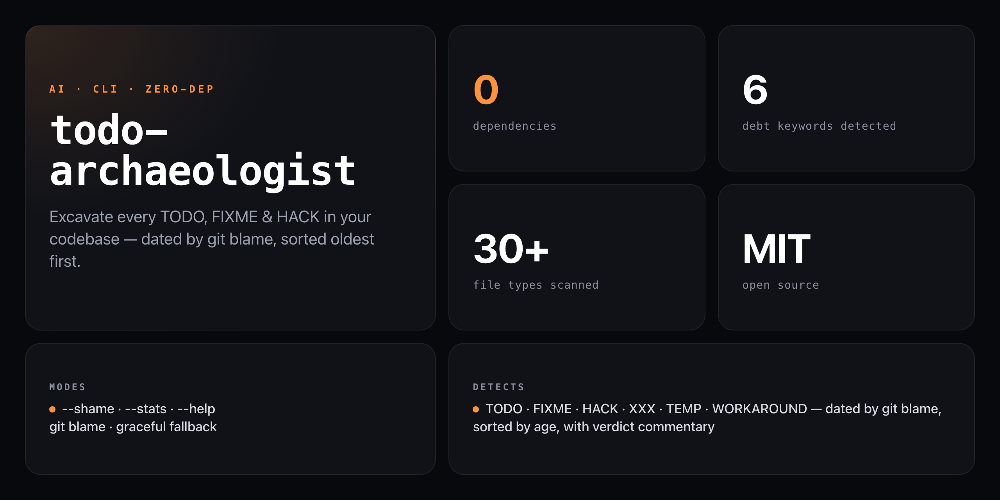

<div align="center">

**Surface the oldest unresolved promises in your codebase — and make the age impossible to ignore.**


</div>

---

Most TODO scanners count comments. `todo-archaeologist` asks *how old are they?* — then answers with git blame timestamps, sorted from oldest survivor to newest arrival, with age-graded commentary that escalates from "Fresh. There's still hope." to "This TODO is a historical monument. Preserve it."

```
  🏛️  TODO ARCHAEOLOGIST
  ━━━━━━━━━━━━━━━━━━━━━━━━━━━━━━━━━━━━━━━━━━

  Excavation site: ./src
  Artifacts found: 23

  Timeline of Broken Promises:
  ━━━━━━━━━━━━━━━━━━━━━━━━━━━━━━━━━━━━━━━━━━

  🦴 2019-03-14  src/utils.js:47
     TODO: refactor this later
     Age: 7 years — "This TODO is a historical monument. Preserve it."

  🦴 2020-11-02  src/auth.js:123
     FIXME: handle edge case
     Age: 5 years — "This FIXME has survived 3 framework migrations."

  🦴 2021-06-15  src/api.js:89
     HACK: temporary workaround
     Age: 4 years — "Nothing is more permanent than a temporary hack."

  Statistics:
  ━━━━━━━━━━━━━━━━━━━━━━━━━━━━━━━━━━━━━━━━━━
  Total artifacts:    23
  Oldest:             7 years  (src/utils.js:47)
  Average age:        2y 4m
  Technical debt age: 53 years
  Most common type:   TODO (15)
  Worst file:         src/utils.js (7 TODOs)

  Verdict: "Your codebase is an archaeological dig site.
           Future developers will study these ruins."
```

## Install

No install required — runs straight from GitHub with zero dependencies:

```bash
npx github:NickCirv/todo-archaeologist
```

## Usage

```bash
# Scan current directory
npx github:NickCirv/todo-archaeologist

# Scan a specific path
npx github:NickCirv/todo-archaeologist ./src

# Show only TODOs older than 1 year (the hall of shame)
npx github:NickCirv/todo-archaeologist --shame

# Show stats only, no timeline
npx github:NickCirv/todo-archaeologist --stats

# Combine: shame mode + stats on a specific path
npx github:NickCirv/todo-archaeologist ./src --shame --stats
```

| Flag | Description |
|------|-------------|
| `[path]` | Directory to scan (default: current directory) |
| `--shame` | Show only TODOs older than 1 year |
| `--stats` | Show aggregate statistics only — no per-item timeline |
| `--help` | Show help |

## How it works

1. **Walk the tree** — recursively scans all code files, skipping `node_modules`, `.git`, `dist`, `build`, and other non-source directories.
2. **Match debt keywords** — flags lines containing `TODO`, `FIXME`, `HACK`, `XXX`, `TEMP`, or `WORKAROUND`.
3. **Date via git blame** — for each matching line, runs `git blame --porcelain` to get the exact commit timestamp when that line was last touched.
4. **Sort oldest first** — undated items (repos without git) appear at the end.
5. **Verdict** — produces an age-graded final verdict based on average debt age across the whole codebase.

### Age commentary scale

| Age | Commentary |
|-----|------------|
| < 1 month | "Fresh. There's still hope." |
| 1–6 months | "Starting to age. Like milk." |
| 6–12 months | "This TODO has seen seasons change." |
| 1–2 years | "Old enough to walk." |
| 2–3 years | "This TODO is old enough to be in second grade." |
| 3–5 years | "This TODO has survived multiple framework wars." |
| 5+ years | "This TODO is a historical monument. Preserve it." |

### Detected keywords

`TODO` · `FIXME` · `HACK` · `XXX` · `TEMP` · `WORKAROUND`

### Scanned file types

JS/TS/JSX/TSX/MJS · Python · Ruby · Go · Rust · Java · Kotlin · Swift · C/C++ · C# · PHP · Vue · Svelte · Astro · Shell · CSS/SCSS/Less · HTML · YAML/TOML/INI · SQL

### Skipped directories

`node_modules` · `.git` · `dist` · `build` · `vendor` · `.next` · `.nuxt` · `coverage` · `out` · `tmp` · `.turbo` · `.svelte-kit`

## What it is NOT

- **Not a linter or formatter.** It reads and reports — it never modifies your code.
- **Not a replacement for a real debt-tracking system.** Use it to surface which files need attention; track the work in your issue tracker.
- **Not git-required.** Without a git repo it skips age detection and reports file locations only.

---

<div align="center">
<sub>Zero dependencies · Node 14+ · MIT · by <a href="https://github.com/NickCirv">NickCirv</a></sub>
</div>
